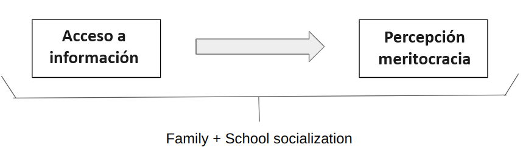
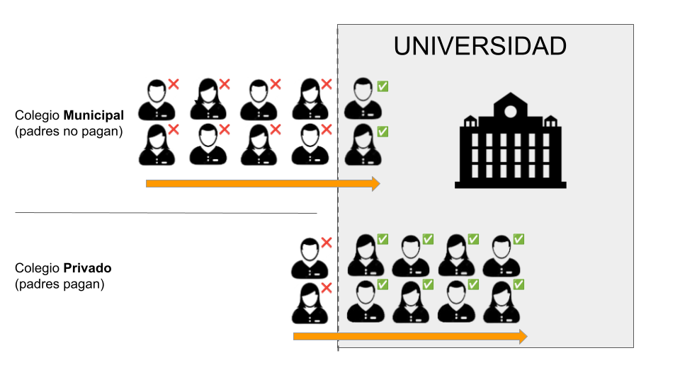
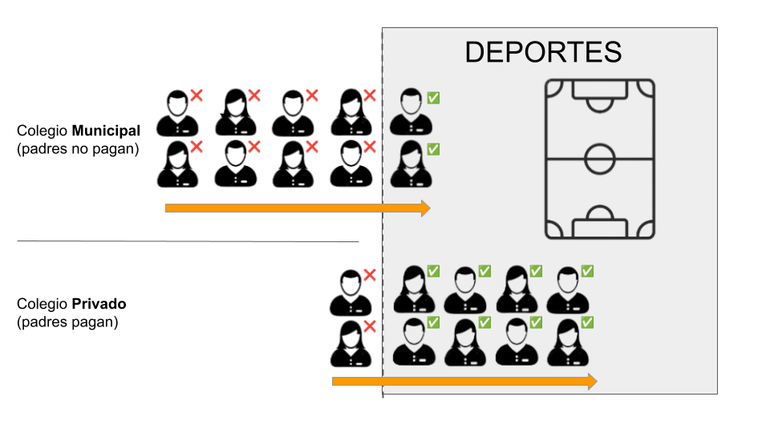

class: middle title-slide

```{r xaringanExtra, echo = FALSE}
  xaringanExtra::use_progress_bar(color = "red", location = c("top"))
```


```{r xaringan-tile-view, echo=FALSE}
xaringanExtra::use_tile_view()
```

.pull-left-narrow[


.small[.red[FONDECYT N°1210847 Meritocracia en la Escuela]

<br>
<br>


<div style="line-height:150%;">
Congreso de Sociología
<br>Santiago, Chile 
2-4 de Mayo 2024
</div>
]]


.pull-right-wide[
.right[

.content-box-red[
## Meritocracia en la etapa escolar: Un experimento de encuesta

]

----


.medium[
<div style="line-height:150%;">
Juan Carlos Castillo, 
<br>Kevin Carrasco,
<br> María Fernanda Nuñez 
<br> & Andreas Laffert<br>
</div>
]
<br>
.small[
<div style="line-height:150%;">
*Departmento de Sociología, Universidad de Chile - COES
</div>
Contacto: [juancastillov@uchile.cl](juancastillov@uchile.cl) - [jc-castillo.com](https://jc-castillo.com)

]
]
]

---

layout: true
class: animated, fadeIn


---
class: roja bottom

# Contexto y motivación


---

.pull-left-narrow[

]

.pull-right-wide[
.red[Meritocracia en la escuela: Fundamentos morales de los mercados educativos e implicaciones para la educación ciudadana] 

ANID/FONDECYT 2021-2024

- Primera etapa:

  - Estudio cualitativo
  - análisis de datos secundarios
  
- Segunda etapa

  - panel de estudio
  - experimentos de encuestas


.small[
Más información:
[jc-castillo.com/project/fondecyt-edumer/](https://jc-castillo.com/project/fondecyt-edumer/)


]
]

---
## Meritocracia 

- Merito = esfuerzo + talento (Young, 1958)

- Asociado a justificación de desigualdad al legitimar diferencias muchas veces asociadas a oportunidades (Mijs, 2016; Sandel, 2020)

- Distinción entre percepción y preferencias por meritocracia (Castillo et al 2023)

---
### Escuela, desigualdad y meritocracia

- Contexto escolar chileno caracterizado por amplias desigualdades, privatización y comodificación (Bellei, 2013; Corvalán et al., 2016).

- Falta de estudios sobre la evaluación de la meritocracia en el sistema educativo chileno por parte de las comunidades escolares

- En línea con la literatura de policy-feedbacks, sería esperable que se valorara la meritocracia a pesar de la desigualdad. 

- Sin embargo, la información sobre desigualdad escolar podría alterar la percepción de meritocracia, extrapolando de literatura sobre preferencias redistributivas (Alesina et al. 2018; Cruces et al. 2013; McCall et al. 2017; Karadja et al. 2017; Nair 2018).

---
## Pregunta de investigación:

- ¿En qué medida la exposición a información sobre desigualdad en el sistema escolar influye en la percepción de meritocracia?

## Hipótesis general:

- La información sobre desigualdad en el sistema escolar disminuye la percepción de meritocracia en la escuela y en la sociedad

---
class: roja bottom

# Este estudio

---
class:middle center



---
### Tratamiento

.center[Tipos de colegio y acceso a la universidad]

* Para entrar a la universidad se necesita tener buenas notas en el colegio y también un buen puntaje en una prueba de selección de lenguaje y matemáticas

* En Chile existen colegios de distinto tipo: municipales, subvencionados y privados. En los colegios municipales no se debe pagar por estudiar, mientras que en los colegios privados las familias tienen que pagar. 
* Existen grandes diferencias en los puntajes de la prueba de acceso a la universidad entre colegios municipales (no pagados) y privados (pagados): 2 de cada 10 estudiantes de colegios municipales logran entrar a la universidad, mientras en el caso de los colegios privados son 8 de cada 10

---
class:middle center




---
### Control

.center[Tipos de colegio y acceso a deportes]

* En Chile existen colegios de distinto tipo: municipales, subvencionados y privados. En los colegios municipales no se debe pagar por estudiar, mientras que en los colegios privados las familias tienen que pagar. 

* Existen grandes diferencias respecto a la práctica de algún deporte por parte de estudiantes de colegios municipales (no pagados) y estudiantes de colegios privados (pagados): 2 de cada 10 estudiantes de colegios municipales practican deportes, mientras en el caso de colegios privados son 8 de cada 10, como se presenta en la siguiente figura: 
---
class:middle center




---
class: roja bottom
# Métodos

---
class: middle

# Datos
.pull-left-narrow[

----]

.pull-right-wide[
* Trabajo de campo entre octubre 2023 y mayo 2024

* 749 estudiantes. 

* 345 mujeres, 369 hombres y 35 personas que se identifican con otro género.

- 375 estudiantes de 6° básico y 374 de 1° medio de 8 escuelas de la región metropolitana.
]

---
class: middle

# Variables
.pull-left[

----
Meritocracia en la sociedad:

- En Chile, las personas son recompensadas por su esfuerzo

- En Chile, las personas son recompensadas por su inteligencia y habilidades
]

.pull-right[
----
Meritocracia en la escuela:
* En esta escuela, los/as estudiantes obtienen las notas que merecen
* En esta escuela, quienes son inteligentes obtienen buenas notas
* En esta escuela, quienes se esfuerzan obtienen buenas notas
]


---
class: roja bottom right

# Resultados 


---
.pull-left-narrow[
####**Comprensión del experimento**]
.pull-right-wide[

]

---
.pull-left-narrow[
####**Comprensión del experimento**]
.pull-right-wide[

]

---
class: center


---
class: center


---
class: center


---
class: center


---
class: center


---
class: center


---
class: roja

.pull-left[
### **.orange[Conclusiones]**
]

--

.pull-right[
### **.orange[A futuro]**

]

---
class: roja middle

# ¡Muchas gracias!

<br>


.right[
Github Repo: [.yellow[ github.com/educacion-meritocracia/edumer-ola1]](https://github.com/educacion-meritocracia/edumer-ola1)
.white[Más información sobre este y otros proyectos: 

[.yellow[www.ciudadania-escolar.cl]](https://ciudadania-escolar.cl/)
]
]
---
class: middle title-slide


.pull-left-narrow[


.small[.red[FONDECYT N°1210847 Meritocracia en la Escuela]


<div style="line-height:150%;">
Congreso de Sociología
<br>Santiago, Chile 
2-4 de Mayo 2024
</div>
]]


.pull-right-wide[
.right[

.content-box-red[
## Meritocracia en la etapa escolar: Un experimento de encuesta

]

----
.medium[
<div style="line-height:150%;">
Juan Carlos Castillo, 
<br>Kevin Carrasco,
<br> María Fernanda Nuñez 
<br> & Andreas Laffert<br>
</div>
]
<br>
.small[
<div style="line-height:150%;">
*Departmento de Sociología, Universidad de Chile - COES
</div>
Contacto: [juancastillov@uchile.cl](juancastillov@uchile.cl) - [jc-castillo.com](https://jc-castillo.com)

]
]
]
